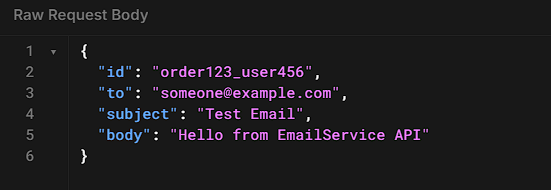
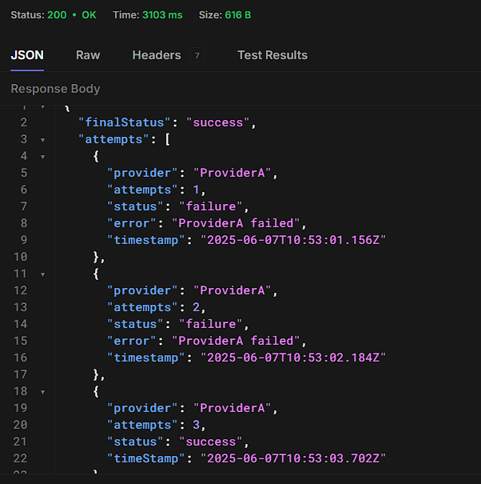
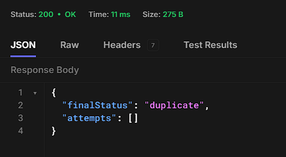
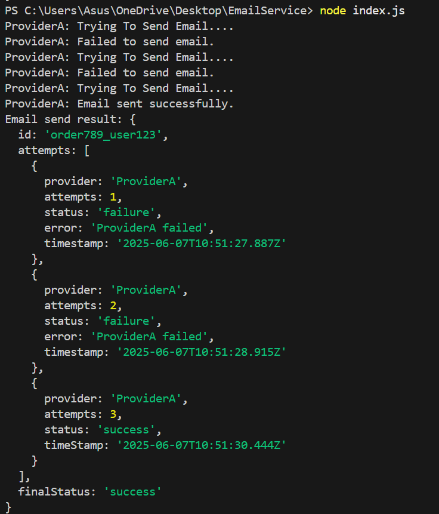

# Email Sending Service

A resilient email sending service built in Node.js with features including:

- Retry logic with exponential backoff
- Rate limiting to control email sending frequency
- Idempotency to prevent duplicate emails
- Fallback provider support
- Status tracking for email attempts

---

## Features

- **Retry & Backoff:** Automatically retries failed email sends with increasing delay.
- **Rate Limiting:** Limits the number of emails sent within a time window to avoid spamming.
- **Idempotency:** Prevents sending duplicate emails by checking unique email IDs.
- **Fallback Provider:** If the primary email provider fails, automatically falls back to a secondary provider.
- **Status Tracking:** Keeps track of email send attempts and final status (success/failure).

---

## Getting Started

### Prerequisites

- Node.js
- npm (Node package manager)

### Installation

1. Clone the repository:
   -bash
   git clone https://github.com/Daksh-Kashyap/emailTask.git

2. Install Dependencies
   npm install

### Running the services

start the API server by running:

node server.js
The server will Listen on port 3000

### API Usage

Send Email

- EndPoint: Post/send-email
- Header: content-Type: application/json
- **Request Body Example**

- **Successfull Response**

 

 ## email sent with same id response(idempotency)

 

## Running Locally

To run the project locally, use the command:

bash
- node index.js

# local response

### Testing

- run the test
- npm test

- Test cover:
- Successful email sending
- Rate limiting behavior

### Notes

- The service retries failed email sends with exponential backoff delays.

- It prevents duplicate sends by enforcing idempotency via unique email IDs.

- Rate limiting is applied to avoid sending too many emails in a short time frame.

- If the primary email provider fails, the service falls back to a secondary provider automatically.

- Logs and status of all attempts are tracked and returned in API responses.

### Author

Daksh Kashyap
